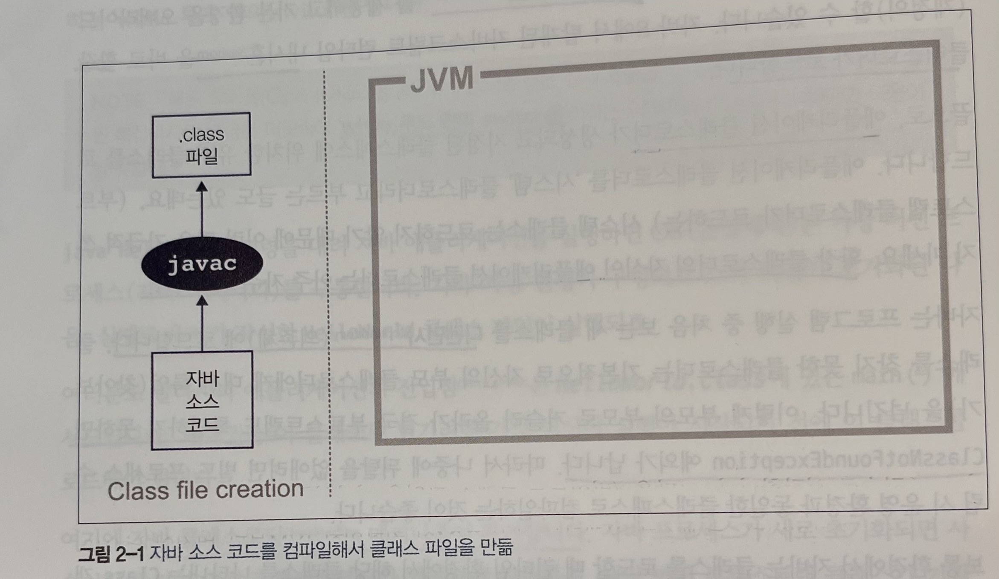
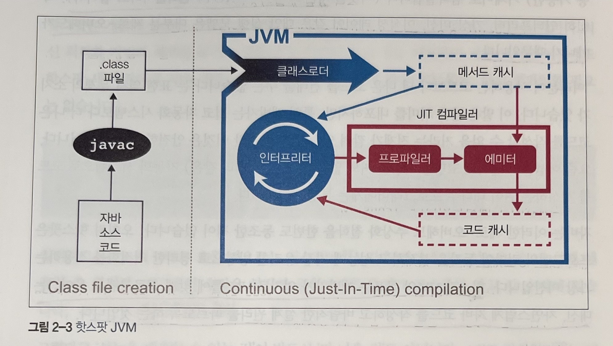

# 2장 : JVM 이야기

---

## 2.1 인터프리팅과 클래스로딩

* JVM은 스택 기반의 해석 머신입니다.
* 자바 클래스로딩 메커니즘
  * 먼저 부트스트랩 클래스가 자바 런타임 코어 클래스를 로드합니다.
  * 그 다음, 확장 클래스로더가 생깁니다. 부트스트랩 클래스로더를 자기 부모로 설정하고 필요할때 클래스로딩 작업을 부모에게 넘깁니다.
  * 마지막으로 애플리케이션 클래스로더가 생성되고 지정된 클래스패스에 위치한 클래스를 로드합니다.

---

## 2.1 인터프리팅과 클래스로딩

* 자바는 프로그램 실행 중 처음 보는 새 클래스를 디펜던시(의존체)에 로드합니다.
* 클래스를 찾지 못하면 자신의 부모 클래스로더에게 이양합니다.
* 최상위 클래스로더에서도 찾지 못하면 예외가 발생합니다.
* 한 시스템에서 클래스는 풀 클래스명과 자신을 로드한 클래스로더, 두 가지 정보로 식별됩니다.

---

## 2.2 바이트코드 실행

* 자바 소스 코드는 실행되기 전 첫번쨰 단계로 자바 컴파일러 javac를 이용해 바이트코드로 이루어진 .class 파일을 만드는 것입니다.

---

## 2.2 바이트코드 실행

* 바이트코드는 특정 컴퓨터 아키텍처에 특정하지 않은, 중간 표현형(IR)입니다. 따라서 컴파일이 완료된 소프트웨어는 JVM 지원 플랫폼 어디서건 실행이 가능합니다.
* 자바 언어에 대해서도 특정하지 않습니다. 따라서 JVM 규격을 따른다면 다른 언어로 작성된 소프트웨어도 JVM에서 실행할 수 있습니다.

---

## 2.2 바이트코드 실행

| 컴포넌트         | 설명                                |
|:-------------|:----------------------------------|
| 매직 넘버        | 클래스 파일의 첫 4바이트는 항상 0xCAFEBABE입니다. |
| 클래스 파일 포맷 버전 | 클래스 파일의 메이저/마이너 버전                |
| 상수 풀         | 클래스 상수들이 모여 있는 위치(예: 문자열)         |
| 액세스 플래그      | 추상 클래스, 정적 클래스 등 클래스 종류를 표시       |
| this 클래스     | 현재 클래스 명                          |
| 슈퍼클래스        | 슈퍼클래스(부모클래스)명                     |
| 인터페이스        | 클래스가 구현한 모든 인터페이스                 |
| 필드           | 클래스에 들어 있는 모든 필드                  |
| 메서드          | 클래스에 들어 있는 모든 메서드                 |
| 속성           | 클래스가 지닌 모든 속성(예: 소스 파일명 등)        |

---

## 2.3 핫스팟 입문

* 핫스팟 VM은 인터프리터와 JIT 컴파일러를 모두 갖춘 하이브리드 VM입니다.
* 핫스팟 VM은 프로그램의 런타임 동작을 분석하고 성능에 가장 유리한 방향으로 영리한 최적화를 적용하는 가상 머신입니다.
* 핫스팟VM은 CPU 타입을 정확히 감지해 가능하면 특정 프로세서의 기능에 맞게 최적화를 적용할 수 있습니다.

---

## 2.3 핫스팟 입문 : AOT 컴파일러

* 자바 진영에서의 AOT 컴파일러
  * GraalVM : GraalVM은 범용 가상 머신이며, AOT 컴파일러 기능을 포함하고 있습니다. 또한 자바 외에도 다양한 언어를 지원합니다. GraalVM은 자바 애플리케이션을 네이티브 머신 코드로 변환하여 실행 속도를 개선할 수 있습니다.
  * Excelsior JET : Excelsior JET은 자바 애플리케이션을 네이티브 머신 코드로 변환하여 실행 속도를 개선할 수 있습니다.

---

## 2.3 핫스팟 입문 : JIT 컴파일러란?

* JIT 컴파일러는 인터프리터가 반복되는 코드를 발견하면 JIT 컴파일러가 해당 코드를 네이티브 코드로 변환합니다.
* JIT 방식으로 컴파일하면 이점이 많습니다. 무엇보다 컴파일러가 해석 단계에서 수집한 추적 정보를 근거로 최적화를 결정한다는게 가장 큰 장점입니다.

---

## 2.3 핫스팟 입문 : 프로필 기반 최적화

* 프로필 기반 최적화(PGO) : 프로그램의 실행 흐름을 분석해 최적화를 수행하는 방식입니다.
* 동적 인라이닝 : JIT 컴파일러가 프로그램 실행 중에 메소드 호출을 분석하고, 호출된 메소드의 내용을 호출 부분에 직접 삽입하는 최적화 기법입니다.
* 가상 호출 : 메소드 호출 시점에 실제로 호출될 메소드를 알 수 없는 경우를 가상 호출이라고 합니다. 객체지향에서의 다형성을 지원하기 위해 메소드 호출 방식입니다.

---

## 2.4 JVM 메모리 관리

* 자바는 가비지 수집이라는 프로세스를 이용해 힙 메모리를 자동 관리하는 방식을 사용합니다.
* 가비지 수집은 힙 메모리에 쌓인 객체 중에서 참조되지 않는 객체를 탐색한 후 제거하는 프로세스입니다.
* 하지만 GC가 실행되면 그 동안 다른 애플리케이션은 모두 중단되고 하던 일을 멈춰야 합니다.(stop the world)

---

## 2.5 스레딩과 자바 메모리 모델(JMM)

* 자바는 멀티스레드 프로그래밍을 기본 지원했습니다.
* 자바 애플리케이션 스레드는 각각 정확히 하나의 전용 OS 스레드에 대응됩니다.
* 공유 스레드 풀을 이용해 전체 자바 애플리케이션 스레드를 실행하는 방안도 있지만, 복잡도 증가에 따른 만족스러운 성능 향상이 나오지 않습니다.
* 자바의 멀티스레드 방식은 다음 세가지 기본 설계 원칙에 기반합니다.
  1. 자바 프로게스의 모든 스레드는 가비지가 수집되는 하나의 공용 힙을 가진다.
  2. 한 스레드가 생성한 객체는 그 객체를 참조하는 다른 스레드가 액세스할 수 있다.
  3. 기본적으로 객체는 변경 가능하다. 즉, 객체 필드에 할당된 값은 프로그래머가 애써 final 키워드로 불변 표시하지 않는 한 바뀔 수 있다.

---

## 2.6 JVM 구현체 종류

| 구현체 이름    | 특징                              |
|-----------|---------------------------------|
| OpenJDK   | 오픈소스 구현체                        |
| Oracle JDK | 상용 구현체                          |
|Zulu| Azul Systems에서 제공하는 OpenJDK 구현체 |
| IcedTea| Red Hat에서 제공하는 OpenJDK 구현체      |
|Zing| Azul Systems에서 제공하는 고성능 상용 구현체  |
|J9| IBM에서 제공하는 상용 구현체               |
|Avian| 경량 구현체                          |
|Android| 구글에서 제공하는 구현체                 |

---

## 2.7 JVM 모니터링과 툴링

* 자바 관리 확장(JMX)
* 자바 에이전트
* JVM 툴 인터페이스(JVMTI)
* 서비서빌리티 에이전트(SA)

---

## 2.7 JVM 모니터링과 툴링 : VisualVM

* 자바 프로세스에 관한 요약 정보를 표시합니다.
* 모니터 : CPU, 힙 사용량등 JVM을 고수준에서 원격 측정한 값들이 표시합니다.
* 스레드 : 실행 중인 애플리케이션 각 스레드가 시간대별로 표시 됩니다. 필요시 스레드 덤프를 뜰 수 있습니다.
* 샘플러 및 프로파일러 : 애플리케이션의 CPU 및 메모리 사용률 관한 단순 샘플링 결과가 표시됩니다.
